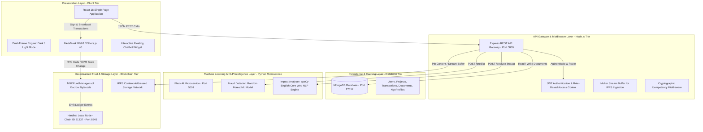

# 📄 Major-R: Decentralized AI-Assisted NGO Transparency & Escrow Platform
## 🏛️ Comprehensive Project Architecture, Technical Implementation Plan & Engineering Master Guide

---

## 📑 Table of Contents
1. [Executive Summary & Abstract](#1-executive-summary--abstract)
2. [Problem Statement & Proposed Solution](#2-problem-statement--proposed-solution)
3. [High-Level System Architecture & Layered Topology](#3-high-level-system-architecture--layered-topology)
4. [System Workflows & Sequence Diagrams](#4-system-workflows--sequence-diagrams)
5. [Complete Implementation Breakdown by Tier](#5-complete-implementation-breakdown-by-tier)
   - [5.1 Decentralized Trust & Escrow Tier (Blockchain)](#51-decentralized-trust--escrow-tier-blockchain)
   - [5.2 Machine Learning & NLP Intelligence Tier (Python Microservices)](#52-machine-learning--nlp-intelligence-tier-python-microservices)
   - [5.3 Content-Addressed Decentralized Storage Tier (IPFS)](#53-content-addressed-decentralized-storage-tier-ipfs)
   - [5.4 Application Server & API Gateway Tier (Node.js / Express)](#54-application-server--api-gateway-tier-nodejs--express)
   - [5.5 Client & Presentation Tier (React 18 / Vite)](#55-client--presentation-tier-react-18--vite)
6. [Mathematical & Algorithmic Formulations](#6-mathematical--algorithmic-formulations)
7. [Security Audits, Idempotency & Threat Mitigation](#7-security-audits-idempotency--threat-mitigation)
8. [Comprehensive Achievements & Feature Verification](#8-comprehensive-achievements--feature-verification)
9. [Future Roadmap & Research Extensions](#9-future-roadmap--research-extensions)
10. [Team Execution & Local Deployment Manual](#10-team-execution--local-deployment-manual)

---

## 1. Executive Summary & Abstract

### 1.1 Abstract
Traditional charitable donation ecosystems are severely hindered by structural opacity, significant intermediary friction, misappropriation of capital, and an absence of verifiable post-disbursement accountability. Donors are forced to rely on self-reported narratives from non-governmental organizations (NGOs) with zero cryptographic guarantees that funds are utilized as intended.

**Major-R** is a trust-minimized, decentralized philanthropy management platform that resolves these systemic inefficiencies. It unites **Ethereum Virtual Machine (EVM) Smart Contract Escrows**, **InterPlanetary File System (IPFS) cryptographic content addressing**, an **AI Machine Learning Anomaly Detection pipeline (Random Forest)**, and an **AI Natural Language Processing (spaCy NLP) Impact Analysis engine** into a unified, responsive full-stack architecture.

### 1.2 Core Pillars
* **Non-Custodial Milestone Escrow:** Capital is never directly disbursed in a single lump-sum; it is locked programmatically on-chain and released exclusively in verified tranches.
* **Real-Time Fraud & Anomaly Mitigation:** Every financial transaction is evaluated dynamically against a Random Forest model trained on the PaySim financial transaction dataset.
* **Autonomous Impact Quantification:** NGO progress reports undergo named entity recognition and semantic sentiment parsing to grade real-world impact and extract concrete beneficiary metrics.
* **Tamper-Evident Proof of Execution:** Invoices, photographic evidence, and audit documents are stored on IPFS, generating immutable Content Identifiers (CIDs).

---

## 2. Problem Statement & Proposed Solution

```
┌─────────────────────────────────────────────────────────┐      ┌─────────────────────────────────────────────────────────┐
│              TRADITIONAL PHILANTHROPY PARADIGM           │      │                MAJOR-R PROPOSED SOLUTION                │
├─────────────────────────────────────────────────────────┤      ├─────────────────────────────────────────────────────────┤
│ ❌ Opacity: Donors cannot track where funds go after wire│  ──► │ ✅ Transparency: Real-time on-chain ledger auditability │
│ ❌ Lump-sum Disbursal: 100% of funds given upfront      │  ──► │ ✅ Milestone Escrow: Tranche release per completed phase │
│ ❌ Fraud Exposure: Fake NGOs & illicit money movement   │  ──► │ ✅ AI Fraud Engine: Real-time ML anomaly screening      │
│ ❌ Subjective Claims: Unverified self-reported impact   │  ──► │ ✅ NLP Assessment: Objective entity & sentiment scoring │
│ ❌ Vulnerable Storage: Centralized mutable file storage │  ──► │ ✅ Decentralized Storage: Immutable IPFS cryptographic CIDs│
└─────────────────────────────────────────────────────────┘      └─────────────────────────────────────────────────────────┘
```

---

## 3. High-Level System Architecture & Layered Topology

The platform follows a **5-Tier Microservices and Decentralized Hybrid Architecture**:



---

## 4. System Workflows & Sequence Diagrams

### 4.1 End-to-End Donation & Milestone Release Lifecycle

```mermaid
sequenceDiagram
    autonumber
    actor Donor
    actor NGO
    actor Admin
    participant Frontend as React 18 UI
    participant Backend as Node.js API
    participant AI as Python AI Service
    participant SC as Smart Contract Escrow
    participant IPFS as IPFS Storage

    Note over NGO, SC: Phase 1: Campaign Creation
    NGO->>Frontend: Register NGO Profile & Submit Milestone Campaign
    Frontend->>SC: createProject(ngoAddress, targetWei, titles, amounts)
    SC-->>Frontend: ProjectCreated Event (blockchainId)
    Frontend->>Backend: POST /api/projects (Save metadata to MongoDB)

    Note over Donor, SC: Phase 2: Donation & Escrow Custody
    Donor->>Frontend: Select Campaign & Enter 1.0 ETH Contribution
    Frontend->>SC: donate(projectId) via MetaMask [msg.value = 1.0 ETH]
    SC->>SC: Lock 1.0 ETH in Escrow Bytecode; raisedAmount += 1.0 ETH
    Frontend->>Backend: POST /api/donations (txHash, amount, idempotencyKey)
    Backend->>AI: POST /predict (step, type, amount, balanceDelta)
    AI-->>Backend: Risk Score: LOW (0.02)
    Backend->>Backend: Persist Transaction (SUCCESS) & Sync Raised Amount

    Note over NGO, AI: Phase 3: Milestone Proof & AI Impact Evaluation
    NGO->>Frontend: Upload Site Completion Invoice / Photos
    Frontend->>Backend: POST /api/documents
    Backend->>IPFS: Pin Buffer -> Generate Content Identifier (CID)
    NGO->>Frontend: Submit Phase 1 Report Text
    Frontend->>Backend: POST /api/projects/:id/analyse-impact
    Backend->>AI: POST /analyse-impact (report text)
    AI->>AI: spaCy NER (Beneficiaries) + Sentiment Lemmas + Budget Extraction
    AI-->>Backend: Impact: HIGH (9.2/10), Completeness: 80%, Beneficiaries: 1200
    Backend->>Backend: Save impactAnalysis to MongoDB

    Note over Admin, SC: Phase 4: Tranche Release & Project Completion
    Admin->>Frontend: Inspect IPFS Receipts & AI Score (9.2/10)
    Admin->>Frontend: Click "Release Tranche" on Milestone 1
    Frontend->>SC: releaseMilestone(projectId, milestoneIndex)
    SC->>SC: Verify Raised Funds >= Milestone Amount
    SC->>NGO: Atomic Transfer (3.0 ETH) to NGO Wallet
    Frontend->>Backend: PUT /api/projects/:id/milestones/0/release
    Backend->>Backend: Update Milestone Status -> RELEASED
    Note over Backend: If all milestones RELEASED -> Project Status = COMPLETED
```

---

## 5. Complete Implementation Breakdown by Tier

### 5.1 Decentralized Trust & Escrow Tier (Blockchain)
* **Contract Specification:** `NGOFundManager.sol` written in Solidity `^0.8.24`.
* **State Structs:**
  ```solidity
  struct Milestone {
      string title;
      uint256 amount;
      bool released;
  }
  struct Project {
      address ngo;
      uint256 targetAmount;
      uint256 raisedAmount;
      uint256 releasedAmount;
      bool active;
      Milestone[] milestones;
  }
  ```
* **Key Functions:**
  * `createProject(...)`: Validates that milestone allocations sum exactly to the target amount; instantiates project state.
  * `donate(uint256 projectId)`: Payable entry point that locks incoming Ether in the contract balance while incrementing `raisedAmount`.
  * `releaseMilestone(uint256 projectId, uint256 milestoneIndex)`: Enforces `onlyOwner` access control, verifies available unreleased balance (`raisedAmount - releasedAmount >= amountToRelease`), marks milestone as released, and transfers Ether directly to `project.ngo`.

### 5.2 Machine Learning & NLP Intelligence Tier (Python Microservices)
* **Microservice Framework:** Flask HTTP server running on port `5001` (`ai/ai_server.py`).
* **Fraud Detection Engine (`ai/fraud_detector.py`):**
  * Supervised classification trained on the PaySim financial transaction benchmark.
  * Implements `RandomForestClassifier` with balanced sub-sampling and standard feature scaling.
  * Evaluates transaction velocity, step timestamps, transfer magnitudes, and account balance differentials to assign continuous risk probabilities $[0.0, 1.0]$.
* **Impact Analysis Engine (`ai/impact_analyser.py`):**
  * Leverages `spacy.load("en_core_web_sm")` for tokenization, lemmatization, and Named Entity Recognition (`CARDINAL`, `ORG`, `DATE`).
  * Evaluates 5 dimensions of project reporting completeness:
    1. Direct & indirect beneficiary headcounts
    2. Documented functional outcomes
    3. Milestone completion markers
    4. Financial & budget utilization percentages
    5. Quantitative impact indicators

### 5.3 Content-Addressed Decentralized Storage Tier (IPFS)
* **Storage Provider:** IPFS Cryptographic Content Addressing (`backend/services/ipfsService.js`).
* **Immutability Guarantee:** Uploaded documents (invoices, audit sheets, site photographs) are hashed with SHA-256 / multihash encoding to generate a Content Identifier (`Qm...`).
* **Tamper Prevention:** Any alteration to a single byte of a receipt produces a completely different hash, making fraudulent invoice replacement detectable.

### 5.4 Application Server & API Gateway Tier (Node.js / Express)
* **Core Engine:** Express.js running on port `5000` (`backend/server.js`).
* **Security & Auth:** JSON Web Tokens (JWT) with HMAC-SHA256 signature verification and strict Role-Based Access Control (`ADMIN`, `NGO`, `DONOR`).
* **Database Models (`backend/models/`):**
  * `User.js`: Identity, hashed credentials (`bcryptjs`), role assignment, linked wallet.
  * `Project.js`: Milestone sub-documents, funding targets, raised amounts, blockchain index, and structured `impactAnalysis` metrics.
  * `Transaction.js`: Cryptographic txHash, gas utilization, block height, idempotency keys, and AI fraud risk scores.
  * `Document.js`: IPFS CIDs, MIME types, project linkages, and uploader identities.
  * `NgoProfile.js`: Government registration credentials, verification status flags, and mission dossiers.

### 5.5 Client & Presentation Tier (React 18 / Vite)
* **Modern Frontend Architecture:** React 18 SPA built with Vite tooling (`frontend/src/App.jsx`).
* **Key Components:**
  * **Dual-Theme Engine:** Dynamic Light and Dark themes with persistent CSS variable tokens.
  * **Web3 MetaMask Integration:** Ethers.js v6 BrowserProvider handling account switching, chain validation (Hardhat `31337`), and transaction signing.
  * **AI Copilot Assistant (`frontend/src/components/ChatbotWidget.jsx`):** Real-time conversational interface querying live database records and on-chain metrics.
  * **Role-Specific Dashboards:** Admin governance dashboard, NGO campaign management console, and Donor contribution history portfolio.

---

## 6. Mathematical & Algorithmic Formulations

### 6.1 Impact Scoring Mathematical Formulation
The Natural Language Impact Analyzer computes an aggregate impact score $S_{\text{impact}} \in [0.0, 10.0]$ defined as:

$$S_{\text{impact}} = \min\left(10.0, \max\left(0.0, B_{\text{comp}} + M_{\text{sent}} + \beta_{\text{ben}}\right)\right)$$

Where:
* **$B_{\text{comp}}$ (Completeness Base, max 4.0):**
  $$B_{\text{comp}} = 4.0 \times \left(\frac{1}{5}\sum_{i=1}^{5} \mathbb{I}(\text{Indicator}_i \text{ present})\right)$$
* **$M_{\text{sent}}$ (Sentiment Polarity Modifier, max 4.0):**
  $$M_{\text{sent}} = \begin{cases} 
  4.0 \times \left(\frac{N_{\text{pos}} - N_{\text{neg}}}{N_{\text{pos}} + N_{\text{neg}}}\right) & \text{if } (N_{\text{pos}} + N_{\text{neg}}) > 0 \\
  2.0 & \text{otherwise (neutral)}
  \end{cases}$$
* **$\beta_{\text{ben}}$ (Beneficiary Quantification Bonus, max 2.0):**
  $$\beta_{\text{ben}} = \begin{cases}
  2.0 & \text{if } \text{Beneficiary Count} > 0 \\
  0.0 & \text{otherwise}
  \end{cases}$$

### 6.2 Impact Tier Discretization
$$\text{Impact Tier} = \begin{cases}
\mathbf{HIGH} & \text{if } S_{\text{impact}} \ge 7.0 \\
\mathbf{MEDIUM} & \text{if } 3.5 \le S_{\text{impact}} < 7.0 \\
\mathbf{LOW} & \text{if } S_{\text{impact}} < 3.5
\end{cases}$$

---

## 7. Security Audits, Idempotency & Threat Mitigation

| Threat Vector | Potential Vulnerability | Major-R Mitigation Strategy |
| :--- | :--- | :--- |
| **Reentrancy Attacks** | Malicious contract calling back into `releaseMilestone()` before state is updated | **Checks-Effects-Interactions Pattern:** `milestone.released = true` and `releasedAmount` are modified before `payable(ngo).transfer()` executes. |
| **Double Spending / Replay** | Network retries creating duplicate donations | **Cryptographic Idempotency Keys:** Unique UUID keys enforced at database index level preventing duplicate transaction insertion. |
| **Unauthorized Fund Drain** | Non-admin attempting to release escrow tranches | **`onlyOwner` Modifier Guard:** Smart contract strictly checks `msg.sender == owner`. |
| **Tampered Receipts** | NGO altering invoices or site photos after submission | **IPFS Content-Addressing:** Files referenced by cryptographic SHA-256 hash. Any alteration invalidates the link. |
| **Sybil / Fake NGO Exploits** | Malicious actors creating fictitious charities | **Multi-Tier KYC Verification:** System Admin must verify legal government registration number before campaigns go active. |

---

## 8. Comprehensive Achievements & Feature Verification

```
┌─────────────────────────────────────────────────────────────────────────────────────────────────┐
│                                   VERIFIED SYSTEM CAPABILITIES                                  │
├─────────────────────────────────────────────────────────────────────────────────────────────────┤
│ [✓] Non-Custodial Smart Contract Escrow deployed on Hardhat Node (0x5FbDB2315678afecb367f032d93) │
│ [✓] Real-Time PaySim Fraud Anomaly Detection (Random Forest, <100ms inference latency)         │
│ [✓] spaCy NLP Impact Analysis Engine extracting Beneficiaries, Outcomes, & Completeness         │
│ [✓] IPFS Content-Addressed Document Upload and Decentralized File Retrieval                     │
│ [✓] Live AI Copilot Assistant Chatbot with instant campaign knowledge retrieval                │
│ [✓] Responsive React 18 UI with dynamic Light & Dark Theme switching engine                    │
│ [✓] Multi-Role Access Control (Admin, NGO, Donor) with JWT session authentication              │
│ [✓] Smart Campaign Lifecycle Management: Active -> 🎯 Fully Funded (Cap Met) -> ✅ Completed    │
│ [✓] Admin On-Chain Tranche Release with immediate status synchronization                        │
└─────────────────────────────────────────────────────────────────────────────────────────────────┘
```

---

## 9. Future Roadmap & Research Extensions

1. **Layer-2 Rollup Migration (Arbitrum / Optimism / Polygon zkEVM):**
   * Migrating the core contracts to an EVM-compatible Layer-2 rollup to reduce gas fees to under $\$0.01$, enabling micro-philanthropy.
2. **Decentralized Autonomous Organization (DAO) Governance:**
   * Transitioning milestone tranche approvals from centralized administrator control to decentralized donor community voting using governance tokens.
3. **Chainlink Decentralized IoT Oracles:**
   * Direct integration with physical IoT sensors (e.g. smart water flow meters on borewells) to automatically trigger escrow milestone releases without manual intervention.
4. **Zero-Knowledge Privacy (zk-SNARKs):**
   * Implementing zero-knowledge proofs to allow donors to make verified philanthropic contributions while preserving complete wallet address anonymity.
5. **W3C Decentralized Identifiers (DIDs):**
   * Cryptographically verifying NGO tax-exempt status (e.g., 80G / 501(c)(3)) using verifiable digital credentials issued by government authorities.

---

## 10. Team Execution & Local Deployment Manual

### 10.1 Environment Prerequisites
* **Node.js:** v20.x or higher
* **Python:** v3.10 or higher (with `spacy`, `scikit-learn`, `flask`)
* **MongoDB:** Local instance running at `mongodb://localhost:27017`
* **MetaMask:** Browser extension configured for `Hardhat Local` (`http://127.0.0.1:8545`, Chain ID `31337`)

### 10.2 Four-Terminal Startup Sequence

```bash
# Terminal 1: Launch Blockchain Node (Port 8545)
cd major_r/blockchain
npx hardhat node

# Terminal 2: Launch Python AI Microservice (Port 5001)
cd major_r/ai
python ai_server.py

# Terminal 3: Launch Node.js Backend Server (Port 5000)
cd major_r/backend
node server.js

# Terminal 4: Launch React Frontend Application (Port 5173)
cd major_r/frontend
npm run dev
```

### 10.3 Default Demo Credentials Matrix

| Role | Email | Password | Primary Functions |
| :--- | :--- | :--- | :--- |
| **ADMIN** | `admin@test.com` | `AdminPass123!` | Verify NGO registrations, inspect fraud logs, release on-chain milestone tranches. |
| **NGO** | `ngo1@test.com` | `NgoPass123!` | Manage profile, upload IPFS receipts, submit reports for AI impact grading. |
| **DONOR** | `donor1@test.com` | `DonorPass123!` | Connect MetaMask wallet, explore campaigns, submit on-chain contributions. |

### 10.4 MetaMask Test Key (Pre-Funded with 10,000 ETH)
* **Account #0 Address:** `0xf39Fd6e51aad88F6F4ce6aB8827279cffFb92266`
* **Private Key:** `0xac0974bec39a17e36ba4a6b4d238ff944bacb478cbed5efcae784d7bf4f2ff80`
